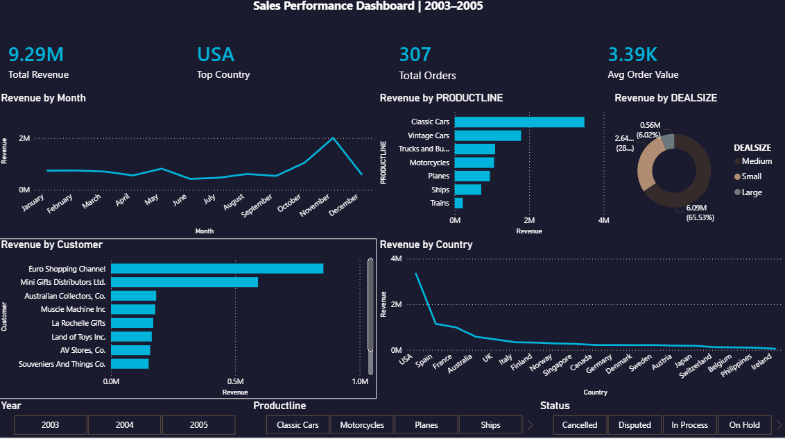

# 📊 Sales Performance Dashboard

## Project Overview
An end-to-end data analysis project analysing sales data from 2003–2005
across products, customers, and countries. Built using Python for data
cleaning and EDA, and Power BI for interactive dashboard visualisation.

---

## Tools Used
| Tool | Purpose |
|---|---|
| Python (Pandas, Matplotlib, Seaborn) | Data cleaning, EDA, statistical analysis |
| Jupyter Notebook | Documented analysis workflow |
| Power BI Desktop | Interactive dashboard |
| DAX | Custom KPI measures |
| GitHub | Version control and portfolio publishing |

---

## Dataset
- **Source:** Kaggle — Sales Data Sample
- **Size:** ~2,800 rows, 25 columns
- **Period:** 2003–2005
- **Fields:** Order details, product lines, customers, countries, deal sizes

---

## What I Did

### 1. Data Cleaning (Python)
- Handled missing values using fillna()
- Removed duplicate records
- Parsed ORDERDATE to datetime format
- Removed outliers using IQR method
- Extracted YEAR, MONTH, QUARTER features

### 2. Exploratory Data Analysis (Python)
- Monthly and quarterly revenue trends
- Revenue by product line and country
- Top 10 customers by revenue
- Month-over-month growth rate
- Correlation analysis between key metrics
- Deal size distribution

### 3. Interactive Dashboard (Power BI)
- 4 KPI cards — Total Revenue, Orders, Avg Order Value, Top Country
- Monthly revenue trend line chart
- Revenue by product line bar chart
- Top 10 customers bar chart
- Revenue by country bar chart
- Deal size donut chart
- 3 interactive slicers — Year, Product Line, Status

---

## Key Insights
- **Classic Cars** is the top performing product line contributing ~40% of revenue
- **USA** is the #1 country by revenue with significant lead over others
- **November** consistently shows the highest monthly revenue across years
- **65% of revenue** comes from Medium sized deals
- **Euro Shopping Channel** is the top customer by total sales value
- Quantity ordered shows **0.52 correlation** with sales — moderate positive driver

---

## Project Structure
├── sales_analysis.ipynb     ← Python cleaning & EDA notebook
├── sales_cleaned.csv        ← Cleaned dataset output
├── Sales_Dashboard.pbix     ← Power BI dashboard file
└── README.md                ← This file
---

## Dashboard Preview

---

## How to Run
1. Clone this repository
2. Open `sales_analysis.ipynb` in Jupyter Notebook
3. Run all cells in order
4. Open `Sales_Dashboard.pbix` in Power BI Desktop

---

*Project by Azhan Javed | Data Analysis Portfolio*
